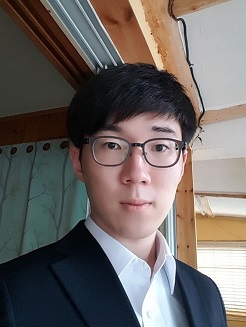

<link rel="stylesheet" href="https://maxcdn.bootstrapcdn.com/font-awesome/4.6.1/css/font-awesome.min.css">

##<i class="fa fa-eye" aria-hidden="true"></i> *Overview*
이것은 **심진용**의 자기소개서 입니다.

##<i class="fa fa-camera-retro" aria-hidden="true"></i> *Profile*

이름 : **심진용(Sim Jin Yong)**

생년월일 : 1992년 5월 16일

휴대폰 : 010-2398-3556

이메일 : <sjydiablo@naver.com>

국적 : 대한민국

주소 : 제주도 제주시 조천읍 와흘전 1길 69-12번지

최종학력 : 제주대학교 컴퓨터공학과 2학년 재학중

자격증 : 정보처리기능사, 운전면허

#####<i class="fa fa-lightbulb-o" aria-hidden="true"></i>*1. 저는 가상현실(VR)과 증강현실(AR), 홀로그램(Hologram)에 관심이 많습니다.*
 2009년 저는 소드아트온라인 이라는 책과 만나게 되었습니다. 그 책의 내용은 VR(Virtual Reality)에 관한 내용이었습니다. 오감마저 지배하는 VR 세계에 들어가서 게임을 하는 내용은 그 당시 저에게 말로 표현하기 어려운 기쁨을 주었습니다. 당시에는 VR이 그리 주목받는 시대가 아니었는데 그때의 저는 VR은 다음 시대를 이끌어갈 기술이라고 생각했습니다. 분명 가상현실과 증강현실, 홀로그램은 일상생활은 물론 엔터테인먼트, 교육, 의학, 군대에도 지대한 영향을 줄 거라고 확신했습니다. 그렇기에 시대의 흐름에 힘을 보태보고자 컴퓨터공학과에 진학하게 되었습니다.

#####<i class="fa fa-plane" aria-hidden="true"></i>*2. 저는 넓은 세상을 보고 왔고 지금도 꾸준히 보러 다니고 있습니다.*
 저는 어릴 때부터 여행을 많이 다녔습니다. 일본, 싱가포르, 홍콩 등 가까운 아시아권 나라뿐만 아니라 미국, 캐나다 같은 멀리 떨어진 서양 문화권도 다녀왔습니다. 많은 문화을 보고 많은 사람을 만났습니다. 저는 여행을 통해 '틀린 것이 아니라 다른 것이다.' 라는 사고를 할 수 있게 되었습니다. 부정을 먼저 하기보다는 다른 관점에서 생각해보려는 저의 사고방식은 앞으로 사회에 나가서 저와는 다른 사람들과 같이 일을 해나갈 때 분명 도움이 될 것으로 생각합니다.

#####<i class="fa fa-refresh" aria-hidden="true"></i>*3. 실패를 경험해봤습니다.*
 사람은 실패를 경험하지 않고는 성장할 수 없다고 합니다. 저는 더 높은 대학에 진학해보고자 재수에 이어 삼수까지 선택했었습니다. 하지만 원하는 대학에 진학하지 못하는 실패를 겪었습니다. 어린 나이에 평범하게 자라면서 사람들은 실패다운 실패를 하기 힘듭니다. 저는 제 미래를 결정할 수 있는 요인 중 하나인 진학에 많은 노력과 시간을 투자해봤고 실패라는 뼈아픈 경험을 했습니다. 제 인생의 전환점이 된 이 실패는 더욱 제가 성공을 갈망하게 되는 계기가 되었습니다.

#####<i class="fa fa-graduation-cap" aria-hidden="true"></i>*4. 졸업하기전에 꼭 이뤄내겠습니다.*
 그저 무난하게 졸업하기 위한 학창시절을 보내지 않고 많은 것을 배워보고 여러 자격증을 따보려고 합니다. 일본어에 많은 관심이 있기에 졸업하기 전에는 꼭 JLPT 1급을 따보겠습니다. 또한, 제가 관심 있는 분야뿐만 아니라 웹 프로그래밍분야, 안드로이드 어플분야 등 다양한 개발을 해봄으로써 많은 경험을 쌓아보겠습니다. 목표한 것을 이뤄낼 수 있는 능력을 갖추고 있다는 것을 증명해 보이겠습니다.

##<i class="fa fa-code-fork" aria-hidden="true"></i>Fork
###<i class="fa fa-map-marker" aria-hidden="true"></i> AR(Augmented Realiy)와 VR(Virtual Reality)
####1.[PRAugmentedReality](https://github.com/JinYongSim/PRAugmentedReality)
- 현실세계에 가상 물체를 겹쳐 보여주는 증강현실 기술은 앞으로 일상생활뿐만 아니라 많은 분야에서 지대한 영향을 미칠 거라 생각합니다. 이 프로젝트는 단순히 앱을 통해서 로케이션에 대한 간단한 정보를 보여줄 뿐이지만 이런 기술이 더욱 발전하면 앞으로는 증강현실 기술을 통해서 그저 보는 것만으로 어떤 물체에 대한 정보를 쉽게 알 수 있게 될 거라 생각하기에 관심을 둬보려고 합니다.

####2.[RajawaliVR](https://github.com/JinYongSim/RajawaliVR)
- 가상현실 기술은 사람이 경험하기 힘들거나 할 수 없는 환경을 구현해 줄 수 있기에 그 이점이 있다고 생각합니다. 게임에서는 경험할 수 없는 판타지 세계를, 의학에서는 쉽게 할 수 없는 수술연습을 대신 해  줄 수도 있고, 군대에서는 사격연습이나 여러 장비를 다루는 경험을 할 수 있게 해줄 것입니다. 아직은 조금 조잡해 보이는 카드 보드와 핸드폰으로 보는 가상세계이지만 천 리 길도 한걸음부터라는 생각으로 작은 것에서부터 먼저 관심을 가지게 된 것이고 언젠가는 의식마저 가상의 공간으로 들어가는 기술이 나올 거라 생각합니다.
