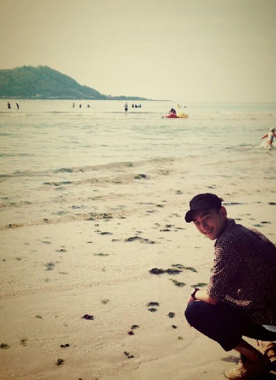

#자기소개서

- - -

##부은형

* 생일: 1992.09.22
* 주소: 제주도 제주시 용강동 1551-1
* Email: boo1984@naver.com
* github: [Jeju-Boobby](https://github.com/Jeju-Boobby)

##성장과정

* 3남 중 막내로 형들에게 괴롭힘을 많이 받으며 인내심을 길렀습니다.
* 중국에서 친구와 자취하며 같이 생활하는 방법, 책임감을 배웠습니다.
* 군대에서 행정병을 일을 하며 저의 인내심이 뛰어나다는 것과, 책임감을     
다시 한번 느꼈습니다.

##언어 능력

* 영어: 잘함
* 중국어: 뛰어남
* 한국어: 원어민

##경력 사항

* [제주대학교](http://www.jejunu.ac.kr/_2014/main.jsp) 컴퓨터공학과, 2016.3 - 재학중
* [연변과학기술대학교](http://www.yust.edu/ysm/kr/main) 컴퓨터공학과, 2011.3 - 2012.2, 2015.3 - 2016.2
* 대한민국 육군 수도화기계보병사단 1여단 133대대 2중대([재구중대](https://namu.wiki/w/%EA%B0%95%EC%9E%AC%EA%B5%AC)) 행정병, 2012.5.22 - 2014.2.21(병장 전역)
* [오현고등학교](http://www.ohyun.hs.kr/home/home.jsp), 2008 - 2010

##취미

* 열창하기
* 돈 모이면 여행가기

---

## Fork

* Blockinger
 - 안드로이드 앱 개발을 공부하고 싶은 목적으로 간단한 프로그램을 통하여 공부하기 위해 Fork 하였다.
 - 3년전에 마지막으로 Commit 하였지만, 보면서 배우기에는 적합하다고 판단하였다.
 - 테트리스 프로그램이며, 블록이 내려오는 속도로 난이도를 조정하였고, 라인 수 별로 점수를 다르게 매긴다.
* startbootstrap
 - 오픈소스 프로젝트 중 MOOC 소개하는 웹사이트를 만들기 위해 찾아본 오픈 웹 테마를 제공하는 사이트이다.
 - MIT License를 사용하고 있어 무상으로 사용, 수정, 배포 할 수 있으나, 모든 복제본 및 중요 부분에 저작권 안내 문구를 포함시켜야 한다.
